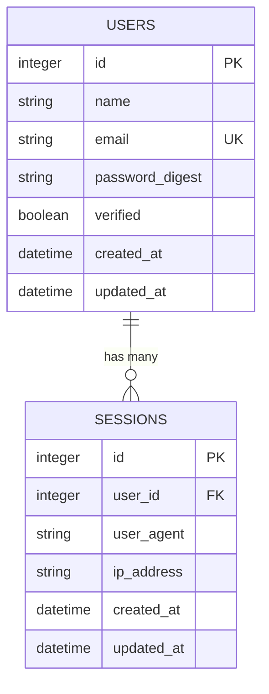

# Database Schema and Models

## TL;DR

The application uses a lightweight database schema focused on user authentication and session management. The primary models are `User` and `Session`, with ActiveRecord used for ORM. The default database is SQLite, but it's configured for easy migration to PostgreSQL or MySQL in production.

## Database Schema Overview



The database schema is defined in `db/schema.rb`:

```ruby
# db/schema.rb (simplified)
ActiveRecord::Schema.define(version: 2025_02_11_160811) do
  create_table "sessions", force: :cascade do |t|
    t.integer "user_id", null: false
    t.string "user_agent"
    t.string "ip_address"
    t.datetime "created_at", null: false
    t.datetime "updated_at", null: false
    t.index ["user_id"], name: "index_sessions_on_user_id"
  end

  create_table "users", force: :cascade do |t|
    t.string "name", null: false
    t.string "email", null: false
    t.string "password_digest", null: false
    t.boolean "verified", default: false, null: false
    t.datetime "created_at", null: false
    t.datetime "updated_at", null: false
    t.index ["email"], name: "index_users_on_email", unique: true
  end

  add_foreign_key "sessions", "users"
end
```

## Migrations

Migrations are used to define the database schema:

```ruby
# db/migrate/20250211160810_create_users.rb
class CreateUsers < ActiveRecord::Migration[8.0]
  def change
    create_table :users do |t|
      t.string :name, null: false
      t.string :email, null: false
      t.string :password_digest, null: false
      t.boolean :verified, null: false, default: false

      t.timestamps
    end
    add_index :users, :email, unique: true
  end
end
```

```ruby
# db/migrate/20250211160811_create_sessions.rb
class CreateSessions < ActiveRecord::Migration[8.0]
  def change
    create_table :sessions do |t|
      t.references :user, null: false, foreign_key: true
      t.string :user_agent
      t.string :ip_address

      t.timestamps
    end
  end
end
```

## Models

### User Model

The `User` model handles user authentication and profile information:

```ruby
# app/models/user.rb
class User < ApplicationRecord
  has_secure_password

  generates_token_for :email_verification, expires_in: 2.days do
    email
  end

  generates_token_for :password_reset, expires_in: 20.minutes do
    password_salt.last(10)
  end

  has_many :sessions, dependent: :destroy

  validates :email, presence: true, uniqueness: true, format: {with: URI::MailTo::EMAIL_REGEXP}
  validates :password, allow_nil: true, length: {minimum: 12}

  normalizes :email, with: -> { _1.strip.downcase }

  before_validation if: :email_changed?, on: :update do
    self.verified = false
  end

  after_update if: :password_digest_previously_changed? do
    sessions.where.not(id: Current.session).delete_all
  end
end
```

Key features:
- `has_secure_password` for bcrypt password encryption
- Token generation for email verification and password resets
- Email normalization and validation
- Password validation (12 character minimum)
- Session management (destroys other sessions when password changes)
- Email verification tracking

### Session Model

The `Session` model tracks user login sessions:

```ruby
# app/models/session.rb
class Session < ApplicationRecord
  belongs_to :user

  before_create do
    self.user_agent = Current.user_agent
    self.ip_address = Current.ip_address
  end
end
```

Key features:
- Belongs to a user
- Automatically captures user agent and IP address
- Used for multi-device session tracking

### Current Model

The `Current` model uses Rails' `CurrentAttributes` for request-scoped global state:

```ruby
# app/models/current.rb
class Current < ActiveSupport::CurrentAttributes
  attribute :session
  attribute :user_agent, :ip_address

  delegate :user, to: :session, allow_nil: true
end
```

Key features:
- Thread-local storage for request data
- Delegates to session for user access
- Stores contextual information like user agent and IP

## Database Configuration

The application is configured to use SQLite in development and test environments:

```ruby
# config/database.yml
default: &default
  adapter: sqlite3
  pool: <%= ENV.fetch("RAILS_MAX_THREADS") { 5 } %>
  timeout: 5000

development:
  <<: *default
  database: db/development.sqlite3

test:
  <<: *default
  database: db/test.sqlite3

production:
  <<: *default
  database: db/production.sqlite3
  # For production, you'd typically use PostgreSQL:
  # adapter: postgresql
  # host: <%= ENV["DATABASE_HOST"] %>
  # username: <%= ENV["DATABASE_USERNAME"] %>
  # password: <%= ENV["DATABASE_PASSWORD"] %>
  # database: <%= ENV["DATABASE_NAME"] %>
```

## Data Access Patterns

### User Lookup

```ruby
# Find a user by ID
user = User.find(id)

# Find a user by email (case-insensitive)
user = User.find_by("LOWER(email) = ?", email.downcase)

# Authenticate a user
user = User.authenticate_by(email: email, password: password)
```

### Session Management

```ruby
# Create a new session
session = user.sessions.create!

# Find current session
session = Session.find_by_id(cookies.signed[:session_token])

# List all sessions for a user
sessions = user.sessions.order(created_at: :desc)

# Delete all other sessions
user.sessions.where.not(id: current_session.id).delete_all
```

## Database Performance Considerations

### Indexes

The database uses indexes for performance:
- `users.email` has a unique index for fast lookups and uniqueness constraint
- `sessions.user_id` has an index for fast session lookups by user

### Query Optimization

The application uses proper ActiveRecord query methods to ensure efficient database access:
- Uses `find_by_id` instead of `find` to avoid exceptions for missing records
- Uses proper associations (`has_many`, `belongs_to`) for relationship navigation
- Uses scoped queries for filtering data sets

## Data Integrity and Constraints

- Foreign key constraint between `sessions` and `users`
- NOT NULL constraints on required fields
- Unique constraint on `users.email`
- Default value for `users.verified` (false)
- Model-level validations for additional constraints

## Seeds

The application includes a seeds file for initial data setup:

```ruby
# db/seeds.rb
# Create a default admin user
User.create!(
  name: "Admin User",
  email: "admin@example.com",
  password: "password123456",
  verified: true
)
```

## Additional Database Features

### Queue Storage

The application uses Solid Queue for background jobs:

```ruby
# db/queue_schema.rb
create_table "solid_queue_blocked_executions", force: :cascade do |t|
  # Schema for blocked job executions
end

create_table "solid_queue_jobs", force: :cascade do |t|
  # Schema for jobs
end

create_table "solid_queue_ready_executions", force: :cascade do |t|
  # Schema for ready executions
end

create_table "solid_queue_scheduled_executions", force: :cascade do |t|
  # Schema for scheduled executions
end
```

### Cache Storage

For caching, the application uses Solid Cache:

```ruby
# db/cache_schema.rb
create_table "solid_cache_entries", force: :cascade do |t|
  # Schema for cache entries
end
```

## Limitations and Future Enhancements

- The current schema is minimal, focused on authentication
- Additional models would be needed for specific application features:
  - Products, orders, etc. for e-commerce
  - Posts, comments, etc. for content systems
  - Projects, tasks, etc. for project management
