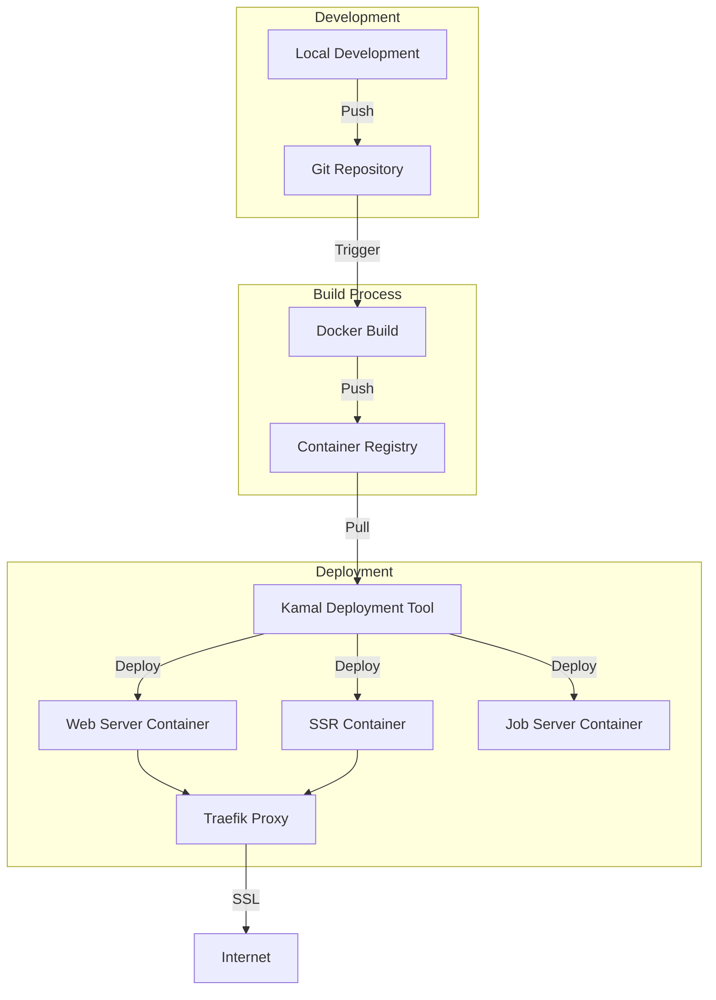

# Deployment and CI/CD

## TL;DR

The application uses Docker for containerization and Kamal for deployment. The Docker setup uses a multi-stage build to optimize image size, and Kamal handles deployment to servers, SSL configuration, and environment variable management. Optional server-side rendering (SSR) support is included.

## Deployment Architecture



## Docker Configuration

The application uses a Docker multi-stage build process defined in `Dockerfile`:

### Base Stage

Sets up the base Ruby image and essential packages:

```dockerfile
ARG RUBY_VERSION=3.4.1
FROM ruby:$RUBY_VERSION-slim AS base

WORKDIR /rails

RUN apt-get update -qq && \
    apt-get install --no-install-recommends -y curl libjemalloc2 libvips sqlite3 && \
    rm -rf /var/lib/apt/lists /var/cache/apt/archives

ENV RAILS_ENV="production" \
    BUNDLE_DEPLOYMENT="1" \
    BUNDLE_PATH="/usr/local/bundle" \
    BUNDLE_WITHOUT="development"
```

### Build Stage

Compiles assets and prepares the application:

```dockerfile
FROM base AS build

# Install build dependencies
RUN apt-get update -qq && \
    apt-get install --no-install-recommends -y build-essential git node-gyp pkg-config python-is-python3 && \
    rm -rf /var/lib/apt/lists /var/cache/apt/archives

# Install Node.js
ARG NODE_VERSION=22.13.1
ENV PATH=/usr/local/node/bin:$PATH
RUN curl -sL https://github.com/nodenv/node-build/archive/master.tar.gz | tar xz -C /tmp/ && \
    /tmp/node-build-master/bin/node-build "${NODE_VERSION}" /usr/local/node && \
    rm -rf /tmp/node-build-master

# Install gems and node modules
COPY Gemfile Gemfile.lock vendor ./
RUN bundle install && \
    rm -rf ~/.bundle/ "${BUNDLE_PATH}"/ruby/*/cache "${BUNDLE_PATH}"/ruby/*/bundler/gems/*/.git && \
    bundle exec bootsnap precompile --gemfile

COPY package.json package-lock.json ./
RUN npm ci && \
    rm -rf ~/.npm

# Copy application code and precompile
COPY . .
RUN bundle exec bootsnap precompile app/ lib/
RUN SECRET_KEY_BASE_DUMMY=1 ./bin/rails assets:precompile
RUN rm -rf node_modules
```

### Final Stage

Creates the production image with minimal size:

```dockerfile
FROM base

# Run as non-root user
RUN groupadd --system --gid 1000 rails && \
    useradd rails --uid 1000 --gid 1000 --create-home --shell /bin/bash

USER 1000:1000

# Copy built artifacts
COPY --chown=rails:rails --from=build "${BUNDLE_PATH}" "${BUNDLE_PATH}"
COPY --chown=rails:rails --from=build /rails /rails

# Entrypoint and command
ENTRYPOINT ["/rails/bin/docker-entrypoint"]
EXPOSE 80
CMD ["./bin/thrust", "./bin/rails", "server"]
```

### SSR Support

For Server-Side Rendering, a separate Dockerfile (`Dockerfile-ssr`) is provided.

## Kamal Deployment

The application uses Kamal for deployment, configured in `config/deploy.yml`:

### Basic Configuration

```yaml
service: inertia_rails_shadcn_starter
image: your-user/inertia_rails_shadcn_starter

servers:
  web:
    - 192.168.0.1

proxy:
  ssl: true
  host: app.example.com

registry:
  username: your-user
  password:
    - KAMAL_REGISTRY_PASSWORD
```

### Environment Variables

```yaml
env:
  secret:
    - RAILS_MASTER_KEY
  clear:
    SOLID_QUEUE_IN_PUMA: true
    # INERTIA_SSR_ENABLED: true
    # INERTIA_SSR_URL: "http://vite_ssr:13714"
    # WEB_CONCURRENCY: 2
```

### Volumes and Asset Management

```yaml
volumes:
  - "inertia_rails_shadcn_starter_storage:/rails/storage"

asset_path: /rails/public
```

### Build Configuration

```yaml
builder:
  arch: amd64
  # dockerfile: Dockerfile-ssr
  cache:
    type: registry
    image: your-user/inertia_rails_shadcn_starter-build-cache
    options: mode=max
```

## Docker Entrypoint

The application uses a custom Docker entrypoint script (`bin/docker-entrypoint`):

```bash
#!/bin/bash -e

# If running the rails server, wait for the database to be ready first
if [ "${*}" == "./bin/rails server" ] || [ "${*}" == "./bin/thrust ./bin/rails server" ]; then
  # Wait for database
  ./bin/rails db:prepare
fi

# Execute the given or default command
exec "${@}"
```

This script ensures the database is prepared before starting the server.

## Server-Side Rendering

The application supports optional SSR for Inertia.js:

1. Uncomment the SSR server configuration in `config/deploy.yml`:
   ```yaml
   servers:
     vite_ssr:
       hosts:
         - 192.168.0.1
       cmd: bundle exec vite ssr
       options:
         network-alias: vite_ssr
   ```

2. Enable SSR in the environment variables:
   ```yaml
   env:
     clear:
       INERTIA_SSR_ENABLED: true
       INERTIA_SSR_URL: "http://vite_ssr:13714"
   ```

3. Use the SSR Dockerfile:
   ```yaml
   builder:
     dockerfile: Dockerfile-ssr
   ```

## CI/CD Process

While the repository doesn't include explicit CI/CD configuration, the setup supports a typical workflow:

1. Developers push changes to the Git repository
2. CI system builds the Docker image using `Dockerfile`
3. CI system runs tests (RSpec, etc.)
4. If tests pass, the Docker image is pushed to the registry
5. Kamal pulls the image and deploys to the servers

Common CI platforms that can be used with this setup include:
- GitHub Actions
- GitLab CI
- CircleCI
- Jenkins

## Deployment Workflows

Kamal provides several aliases for common tasks:

```yaml
aliases:
  console: app exec --interactive --reuse "bin/rails console"
  shell: app exec --interactive --reuse "bash"
  logs: app logs -f
  dbc: app exec --interactive --reuse "bin/rails dbconsole"
```

### Common Deployment Commands

```bash
# Deploy the application
bin/kamal deploy

# View logs
bin/kamal logs

# Access Rails console
bin/kamal console

# Execute a shell in the container
bin/kamal shell

# Rollback to the previous version
bin/kamal rollback

# Access the database console
bin/kamal dbc
```

## Scaling Considerations

The application is configured for a simple deployment but supports scaling:

1. **Horizontal Scaling**: Add more servers to the `servers` section
2. **Job Processing**: Uncomment and configure the `job` server section
3. **Database**: Configure an external database via the `DB_HOST` environment variable
4. **Caching**: Add Redis as an accessory service

## Accessory Services

Kamal supports accessory services like databases and Redis:

```yaml
accessories:
  db:
    image: mysql:8.0
    host: 192.168.0.2
    port: "127.0.0.1:3306:3306"
    env:
      clear:
        MYSQL_ROOT_HOST: '%'
      secret:
        - MYSQL_ROOT_PASSWORD
    files:
      - config/mysql/production.cnf:/etc/mysql/my.cnf
    directories:
      - data:/var/lib/mysql
  redis:
    image: redis:7.0
    host: 192.168.0.2
    port: 6379
    directories:
      - data:/data
```

## Production Configuration

### SSL

SSL is handled by Traefik proxy via Let's Encrypt:

```yaml
proxy:
  ssl: true
  host: app.example.com
```

### Performance Tuning

Several environment variables can be set to tune performance:

```yaml
env:
  clear:
    WEB_CONCURRENCY: 2      # Number of Puma workers
    JOB_CONCURRENCY: 3      # Number of job workers
    RAILS_LOG_LEVEL: info   # Log level
```

### Security Considerations

1. Secrets are stored in `.kamal/secrets` (not in the repository)
2. The application runs as a non-root user (UID 1000)
3. SSL is enabled by default
4. Minimal packages are installed in the Docker image

## Known Limitations

1. The default setup uses SQLite, which isn't ideal for production
2. Job processing is done in the web server process by default
3. Scaling requires manual configuration changes
