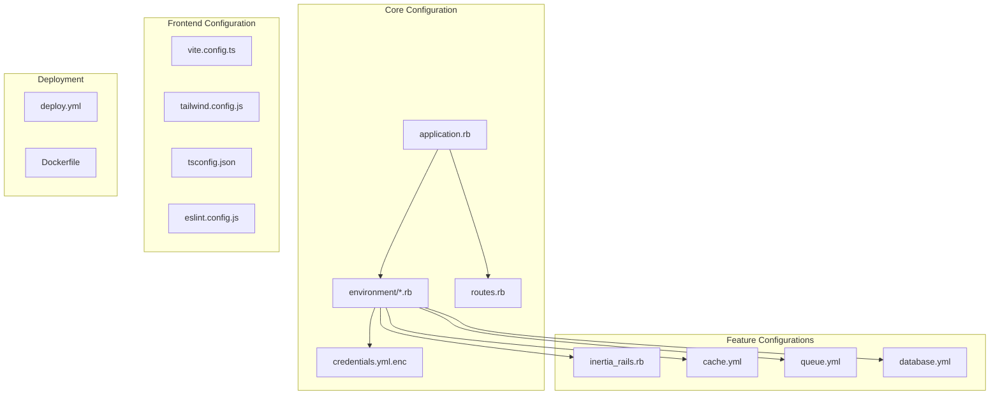

# Configuration Management

## TL;DR

The application uses Rails' conventional configuration approach with environment-specific settings in `config/environments/`, credentials management via encrypted files, environment variables for sensitive data, and Vite for frontend asset configuration. Solid Queue and Solid Cache are used for background job processing and caching.

## Configuration Structure



## Rails Configuration

The core Rails configuration is defined in `config/application.rb`:

```ruby
# config/application.rb (key sections)
module InertiaRailsShadcnStarter
  class Application < Rails::Application
    # Initialize configuration defaults for Rails 8.0
    config.load_defaults 8.0

    # Configuring the database and using solid queue/cache
    config.solid_queue.connects_to = { database: { writing: :queue } }
    config.active_record.encryption.primary_key = Rails.application.credentials.active_record_encryption&.primary_key
    config.active_record.encryption.deterministic_key = Rails.application.credentials.active_record_encryption&.deterministic_key
    config.active_record.encryption.key_derivation_salt = Rails.application.credentials.active_record_encryption&.key_derivation_salt

    # Configure caching and queueing
    config.active_job.queue_adapter = :solid_queue
    config.action_mailer.deliver_later_queue_name = :default

    # Use JavaScript with ESM import maps
    config.importmap.draw do
      pin "@rails/ujs", to: "rails-ujs.js"
    end
  end
end
```

## Environment-Specific Configuration

The application includes environment-specific configuration files:

### Development Environment

```ruby
# config/environments/development.rb (key sections)
Rails.application.configure do
  # Settings for development environment
  config.cache_classes = false
  config.eager_load = false
  config.consider_all_requests_local = true

  # Development-specific database configuration
  if Rails.root.join("tmp/caching-dev.txt").exist?
    config.action_controller.perform_caching = true
    config.action_controller.enable_fragment_cache_logging = true
    config.cache_store = :memory_store
    config.public_file_server.headers = {
      "Cache-Control" => "public, max-age=#{2.days.to_i}"
    }
  else
    config.action_controller.perform_caching = false
    config.cache_store = :null_store
  end

  # Mailer configuration
  config.action_mailer.raise_delivery_errors = false
  config.action_mailer.perform_caching = false
  config.action_mailer.delivery_method = :letter_opener
  config.action_mailer.default_url_options = { host: "localhost", port: 3000 }

  # Print deprecation notices
  config.active_support.deprecation = :log

  # Raise exceptions for disallowed deprecations.
  config.active_support.disallowed_deprecation = :raise

  # Log disallowed deprecations.
  config.active_support.disallowed_deprecation_warnings = []

  # Raise an error on page load if there are pending migrations.
  config.active_record.migration_error = :page_load

  # Highlight code that triggered database queries in logs.
  config.active_record.verbose_query_logs = true

  # Debug mode disables concatenation and preprocessing of assets.
  config.assets.debug = true

  # Suppress logger output for asset requests.
  config.assets.quiet = true

  # Use Solid Cache in development
  config.cache_store = :solid_cache_store, { expires_in: 1.day }
end
```

### Production Environment

```ruby
# config/environments/production.rb (key sections)
Rails.application.configure do
  # Production environment settings
  config.cache_classes = true
  config.eager_load = true
  config.consider_all_requests_local = false
  config.action_controller.perform_caching = true

  # Serve static files from the `/public` folder
  config.public_file_server.enabled = ENV["RAILS_SERVE_STATIC_FILES"].present?

  # Enable serving of images, stylesheets, and JavaScripts from an asset server.
  # config.asset_host = "http://assets.example.com"

  # Specifies the header that your server uses for sending files.
  config.action_dispatch.x_sendfile_header = "X-Accel-Redirect" # for NGINX

  # Force all access to the app over SSL, use Strict-Transport-Security, and use secure cookies.
  config.force_ssl = true

  # Log level
  config.log_level = :info

  # Prepend all log lines with the following tags.
  config.log_tags = [ :request_id ]

  # Use a different cache store in production.
  config.cache_store = :solid_cache_store

  # Use a real queuing backend for Active Job.
  config.active_job.queue_adapter = :solid_queue

  # Action Cable configuration
  config.action_cable.mount_path = nil
  config.action_cable.url = "wss://#{ENV.fetch("RAILS_HOST")}/cable"
  config.action_cable.allowed_request_origins = [ "https://#{ENV.fetch("RAILS_HOST", "example.com")}" ]

  # Mailer configuration
  config.action_mailer.perform_caching = false
  config.action_mailer.default_url_options = { host: ENV.fetch("RAILS_HOST", "example.com"), protocol: "https" }
  config.action_mailer.smtp_settings = {
    address: ENV.fetch("SMTP_ADDRESS", "smtp.mailgun.org"),
    port: ENV.fetch("SMTP_PORT", 587),
    domain: ENV.fetch("SMTP_DOMAIN", "example.com"),
    authentication: ENV.fetch("SMTP_AUTHENTICATION", "plain"),
    user_name: ENV.fetch("SMTP_USERNAME", nil),
    password: ENV.fetch("SMTP_PASSWORD", nil),
    enable_starttls_auto: true
  }

  # Exception handling
  config.action_dispatch.show_exceptions = :rescuable
  config.exceptions_app = routes

  # Enable locale fallbacks for I18n
  config.i18n.fallbacks = true

  # Send deprecation notices to registered listeners.
  config.active_support.deprecation = :notify

  # Don't log passwords
  config.filter_parameters += [:password, :password_confirmation, :current_password]
end
```

### Test Environment

```ruby
# config/environments/test.rb (key sections)
Rails.application.configure do
  # Test environment settings
  config.cache_classes = false
  config.eager_load = false
  config.public_file_server.enabled = true
  config.action_controller.perform_caching = false
  config.action_dispatch.show_exceptions = :rescuable
  config.action_controller.allow_forgery_protection = false
  config.active_storage.service = :test
  config.action_mailer.perform_caching = false
  config.action_mailer.delivery_method = :test
  config.active_support.deprecation = :stderr
  config.active_support.disallowed_deprecation = :raise
  config.active_support.disallowed_deprecation_warnings = []
  config.action_mailer.default_url_options = { host: "localhost", port: 3000 }
end
```

## Credentials Management

The application uses Rails' encrypted credentials system:

```bash
# View credentials
EDITOR="code --wait" rails credentials:edit

# Edit environment-specific credentials
EDITOR="code --wait" rails credentials:edit --environment production
```

Credentials structure (example):

```yaml
# config/credentials.yml.enc (decrypted example)
secret_key_base: abcdef1234567890...

active_record_encryption:
  primary_key: ...
  deterministic_key: ...
  key_derivation_salt: ...

smtp:
  username: apikey
  password: SG.example...

aws:
  access_key_id: AKIA...
  secret_access_key: ...
```

## Background Job Configuration

The application uses Solid Queue for background job processing:

```yaml
# config/queue.yml
default: &default
  dispatchers:
    - polling_interval: 1
      batch_size: 500
  workers:
    - queues: "*"
      threads: 3
      processes: <%= ENV.fetch("JOB_CONCURRENCY", 1) %>
      polling_interval: 0.1

development:
  <<: *default

test:
  <<: *default

production:
  <<: *default
```

## Caching Configuration

Solid Cache is used for caching:

```yaml
# config/cache.yml
default: &default
  options:
    expires_in: 1.day

development:
  <<: *default

test:
  <<: *default

production:
  <<: *default
  options:
    expires_in: 7.days
```

## Inertia.js Configuration

Inertia.js is configured in `config/initializers/inertia_rails.rb`:

```ruby
# config/initializers/inertia_rails.rb
InertiaRails.configure do |config|
  config.version = ViteRuby.digest
  config.encrypt_history = true
  config.ssr_enabled = ENV.fetch("INERTIA_SSR_ENABLED", false)
  config.ssr_url = ENV.fetch("INERTIA_SSR_URL", "http://localhost:13714")
end
```

## Vite Configuration

The application uses Vite for frontend asset bundling:

```javascript
// vite.config.ts
import react from '@vitejs/plugin-react'
import tailwindcss from '@tailwindcss/vite'
import { defineConfig } from 'vite'
import RubyPlugin from 'vite-plugin-ruby'

export default defineConfig({
  ssr: {
    noExternal: true,
  },
  plugins: [
    react(),
    tailwindcss(),
    RubyPlugin(),
  ],
})
```

```json
// config/vite.json
{
  "all": {
    "watchAdditionalPaths": []
  },
  "development": {
    "autoBuild": true,
    "publicOutputDir": "vite-dev",
    "port": 3036
  },
  "test": {
    "autoBuild": true,
    "publicOutputDir": "vite-test",
    "port": 3037
  }
}
```

## Environment Variables

The application uses environment variables for configuration, especially in production:

| Variable | Description | Used In |
|----------|-------------|---------|
| `RAILS_MASTER_KEY` | Decryption key for credentials | All environments |
| `RAILS_HOST` | Hostname for the application | Production |
| `DATABASE_URL` | Database connection string | Production |
| `RAILS_MAX_THREADS` | Max number of threads | Production |
| `WEB_CONCURRENCY` | Number of Puma workers | Production |
| `SMTP_ADDRESS` | SMTP server address | Production |
| `SMTP_PORT` | SMTP server port | Production |
| `SMTP_DOMAIN` | SMTP domain | Production |
| `SMTP_USERNAME` | SMTP username | Production |
| `SMTP_PASSWORD` | SMTP password | Production |
| `RAILS_LOG_TO_STDOUT` | Whether to log to STDOUT | Production |
| `INERTIA_SSR_ENABLED` | Enable SSR for Inertia | All environments |
| `INERTIA_SSR_URL` | URL for the SSR server | All environments |
| `JOB_CONCURRENCY` | Number of job workers | Production |

## TypeScript Configuration

```json
// tsconfig.json
{
  "compilerOptions": {
    "target": "ESNext",
    "lib": ["DOM", "DOM.Iterable", "ESNext"],
    "allowJs": true,
    "skipLibCheck": true,
    "esModuleInterop": true,
    "allowSyntheticDefaultImports": true,
    "strict": true,
    "forceConsistentCasingInFileNames": true,
    "noFallthroughCasesInSwitch": true,
    "module": "ESNext",
    "moduleResolution": "bundler",
    "resolveJsonModule": true,
    "isolatedModules": true,
    "noEmit": true,
    "jsx": "react-jsx",
    "baseUrl": ".",
    "paths": {
      "@/*": ["app/frontend/*"]
    }
  },
  "include": ["app/frontend"]
}
```

## Tailwind CSS Configuration

```javascript
// tailwind.config.js
/** @type {import('tailwindcss').Config} */
module.exports = {
  darkMode: ["class"],
  content: [
    "./app/views/**/*.{html,html.erb,erb}",
    "./app/frontend/**/*.{js,ts,jsx,tsx}",
  ],
  theme: {
    container: {
      center: true,
      padding: "2rem",
      screens: {
        "2xl": "1400px",
      },
    },
    extend: {
      colors: {
        border: "var(--border)",
        input: "var(--input)",
        ring: "var(--ring)",
        background: "var(--background)",
        foreground: "var(--foreground)",
        primary: {
          DEFAULT: "var(--primary)",
          foreground: "var(--primary-foreground)",
        },
        // Additional color configurations...
      },
      borderRadius: {
        lg: "var(--radius)",
        md: "calc(var(--radius) - 2px)",
        sm: "calc(var(--radius) - 4px)",
      },
      keyframes: {
        // Animation keyframes...
      },
      animation: {
        // Animations...
      },
    },
  },
  plugins: [
    require("tailwindcss-animate"),
    require("@tailwindcss/typography"),
    require("@tailwindcss/forms"),
  ],
};
```

## Database Configuration

```yaml
# config/database.yml
default: &default
  adapter: sqlite3
  pool: <%= ENV.fetch("RAILS_MAX_THREADS") { 5 } %>
  timeout: 5000

development:
  <<: *default
  database: db/development.sqlite3

test:
  <<: *default
  database: db/test.sqlite3

production:
  <<: *default
  database: db/production.sqlite3
  # Uncomment for PostgreSQL in production
  # adapter: postgresql
  # url: <%= ENV['DATABASE_URL'] %>
```

## Routes Configuration

```ruby
# config/routes.rb
Rails.application.routes.draw do
  get  "sign_in", to: "sessions#new", as: :sign_in
  post "sign_in", to: "sessions#create"
  get  "sign_up", to: "users#new", as: :sign_up
  post "sign_up", to: "users#create"

  resources :sessions, only: [:destroy]
  resource :users, only: [:destroy]

  namespace :identity do
    resource :email,              only: [:edit, :update]
    resource :email_verification, only: [:show, :create]
    resource :password_reset,     only: [:new, :edit, :create, :update]
  end

  get :dashboard, to: "dashboard#index"

  namespace :settings do
    resource :profile, only: [:show, :update]
    resource :password, only: [:show, :update]
    resource :email, only: [:show, :update]
    resources :sessions, only: [:index]
  end
  inertia "settings/appearance" => "settings/appearance"

  root "home#index"
end
```

## Puma Configuration

```ruby
# config/puma.rb
max_threads_count = ENV.fetch("RAILS_MAX_THREADS") { 5 }
min_threads_count = ENV.fetch("RAILS_MIN_THREADS") { max_threads_count }
threads min_threads_count, max_threads_count

worker_timeout 3600 if ENV.fetch("RAILS_ENV", "development") == "development"

port ENV.fetch("PORT") { 3000 }

environment ENV.fetch("RAILS_ENV") { "development" }

pidfile ENV.fetch("PIDFILE") { "tmp/pids/server.pid" }

workers ENV.fetch("WEB_CONCURRENCY") { 0 }

plugin :tmp_restart
