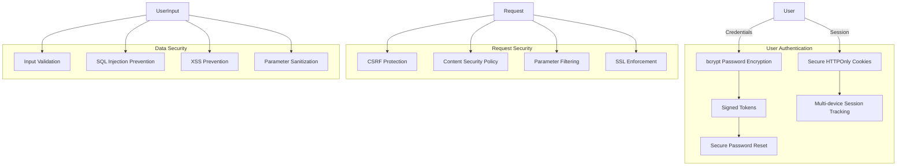

# Security and Error Handling

## TL;DR

The application implements comprehensive security measures including bcrypt password encryption, secure session management, CSRF protection, strict Content Security Policy, and parameter filtering. Error handling follows Rails conventions with custom error pages and structured logging.

## Security Implementation



### Authentication Security

The application uses bcrypt for password hashing via `has_secure_password`:

```ruby
# app/models/user.rb
class User < ApplicationRecord
  has_secure_password

  validates :password, allow_nil: true, length: {minimum: 12}
  
  # ...
end
```

Key security features:
- Minimum 12-character password requirement
- Email verification via secure tokens
- Time-limited password reset tokens
- Invalidation of other sessions when password changes
- Prevention of session fixation attacks

### Session Management

Sessions are securely managed:

```ruby
# app/controllers/sessions_controller.rb
def create
  if user = User.authenticate_by(email: params[:email], password: params[:password])
    @session = user.sessions.create!
    cookies.signed.permanent[:session_token] = {value: @session.id, httponly: true}

    redirect_to dashboard_path, notice: "Signed in successfully"
  else
    redirect_to sign_in_path, alert: "That email or password is incorrect"
  end
end
```

Key session security features:
- HTTPOnly cookies prevent JavaScript access
- Signed cookies prevent tampering
- Recording of IP address and user agent for detecting suspicious activity
- Ability to terminate other sessions
- Proper session termination on logout

### CSRF Protection

Rails' built-in CSRF protection is enabled:

```ruby
# app/controllers/application_controller.rb
class ApplicationController < ActionController::Base
  # CSRF protection is enabled by default in Rails
  # protect_from_forgery with: :exception
end
```

For Inertia.js requests, CSRF tokens are automatically included in responses.

### Content Security Policy

A strict Content Security Policy is defined:

```ruby
# config/initializers/content_security_policy.rb
Rails.application.config.content_security_policy do |policy|
  policy.default_src :self, :https
  policy.font_src    :self, :https, :data
  policy.img_src     :self, :https, :data
  policy.object_src  :none
  policy.script_src  :self, :https
  policy.style_src   :self, :https
  policy.connect_src :self, :https, "ws://localhost:3000", "wss://localhost:3000"
  
  # Specify URI for violation reports
  # policy.report_uri "/csp-violation-report-endpoint"
end
```

### Parameter Filtering

Sensitive parameters are filtered from logs:

```ruby
# config/initializers/filter_parameter_logging.rb
Rails.application.config.filter_parameters += [
  :passw, :secret, :token, :_key, :crypt, :salt, :certificate, :otp, :ssn,
  :password, :password_confirmation, :current_password
]
```

### SSL Configuration

SSL is enforced in production:

```ruby
# config/environments/production.rb
config.force_ssl = true
```

### Secure Headers

Headers are configured for security:

```ruby
# X-Frame-Options is set to deny by default in Rails
# config.action_dispatch.default_headers = {
#   'X-Frame-Options' => 'DENY',
#   'X-Content-Type-Options' => 'nosniff',
#   'X-XSS-Protection' => '1; mode=block'
# }
```

## Error Handling

### Exception Handling

Rails' exception handling is configured:

```ruby
# config/environments/production.rb
config.action_dispatch.show_exceptions = :rescuable
config.exceptions_app = routes
```

### Custom Error Pages

The application includes custom error pages:

```
public/400.html - Bad Request
public/404.html - Not Found
public/422.html - Unprocessable Entity
public/500.html - Internal Server Error
```

### Error Logging

Errors are logged using the Rails logger:

```ruby
# config/environments/production.rb
config.log_level = :info

# Example of error logging in code
rescue => e
  Rails.logger.error "Error processing request: #{e.message}"
  Rails.logger.error e.backtrace.join("\n")
  # Handle the error
end
```

### Inertia Error Handling

Inertia.js errors are handled with shared data:

```ruby
# app/controllers/inertia_controller.rb
inertia_share flash: -> { flash.to_hash }

private

def inertia_errors(model, full_messages: true)
  {
    errors: model.errors.to_hash(full_messages).transform_values(&:to_sentence)
  }
end

# Example usage in a controller action
def create
  @user = User.new(user_params)

  if @user.save
    # Success path
  else
    redirect_to sign_up_path, inertia: inertia_errors(@user)
  end
end
```

In the frontend, errors are handled using form helpers:

```tsx
import { useForm } from "@inertiajs/react"

const { data, setData, post, processing, errors } = useForm({
  email: "",
  password: "",
})

// In the JSX:
{errors.email && <InputError message={errors.email} />}
```

### Graceful Degradation

For browsers not meeting minimum requirements:

```ruby
# app/controllers/application_controller.rb
allow_browser versions: :modern
```

An unsupported browser page is shown:

```
public/406-unsupported-browser.html
```

## Security Best Practices Implementation

### Input Validation

All user input is validated:

```ruby
# app/models/user.rb
validates :email, presence: true, uniqueness: true, format: {with: URI::MailTo::EMAIL_REGEXP}
validates :password, allow_nil: true, length: {minimum: 12}

# app/controllers/users_controller.rb
def user_params
  params.require(:user).permit(:name, :email, :password, :password_confirmation)
end
```

### SQL Injection Prevention

ActiveRecord query methods are used to prevent SQL injection:

```ruby
# Safe query methods
user = User.find(id)
users = User.where(verified: true)

# Safe parameterized queries
User.where("email = ?", email)
```

### XSS Prevention

XSS is prevented by:
- React's automatic escaping
- Rails' built-in escaping for view templates
- Content Security Policy

### HTTPS Everywhere

HTTPS is enforced in production:

```ruby
# config/environments/production.rb
config.force_ssl = true
```

This sets:
- HSTS headers
- Secure cookies
- HTTPS-only cookies

## Error Handling Strategies

### Development vs. Production

Different error handling for development and production:

```ruby
# config/environments/development.rb
config.consider_all_requests_local = true

# config/environments/production.rb
config.consider_all_requests_local = false
config.action_dispatch.show_exceptions = :rescuable
```

### Flash Messages

Flash messages provide user feedback:

```ruby
# app/controllers/users_controller.rb
redirect_to dashboard_path, notice: "Welcome! You have signed up successfully"

# app/frontend/hooks/use-flash.tsx
useEffect(() => {
  if (currentFlash.alert) {
    toast.error(currentFlash.alert)
  }
  if (currentFlash.notice) {
    toast(currentFlash.notice)
  }
}, [currentFlash])
```

### Validation Errors

Validation errors are displayed to users:

```tsx
// app/frontend/components/form.tsx
<FormField
  name="email"
  render={({ field, error }) => (
    <FormItem>
      <FormLabel>Email</FormLabel>
      <FormControl>
        <Input {...field} type="email" />
      </FormControl>
      <FormMessage>{error}</FormMessage>
    </FormItem>
  )}
/>
```

## Known Security Limitations

1. Default SQLite database lacks advanced security features
2. Limited protection against DoS attacks
3. No rate limiting for login attempts
4. No two-factor authentication
5. No automated security scanning in CI/CD pipeline (though Brakeman is available)

## Future Security Enhancements

Potential future security improvements:
- Two-factor authentication
- Rate limiting for sensitive actions
- IP-based blocking
- Enhanced session monitoring
- Security event logging and alerting
- Integration with a Web Application Firewall
