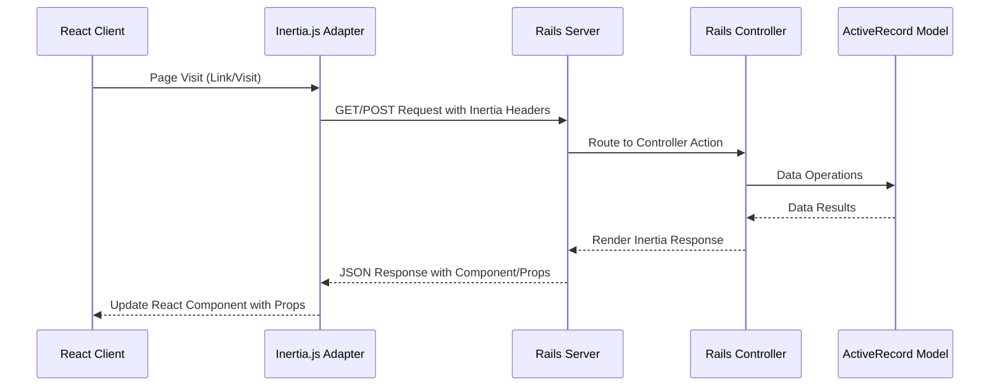
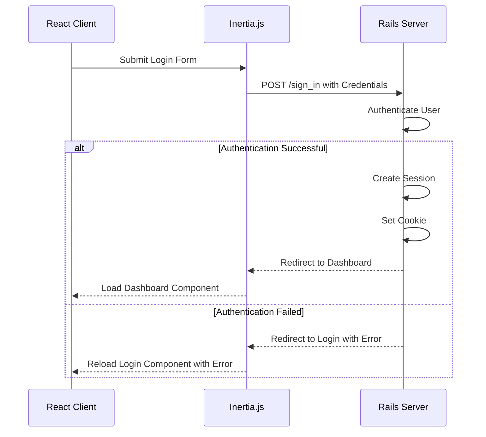

# API Design and Data Flow

## TL;DR

This application doesn't use a traditional REST API but instead uses Inertia.js to bridge Rails and React. Inertia provides a SPA-like experience while leveraging server-side routing, with data being passed as props during page visits. Form submissions are handled through Inertia's form helpers, and server responses are structured to work with Inertia's expectations.

## Inertia.js Communication Model



## Request/Response Cycle

Unlike traditional APIs that return pure JSON data, Inertia.js requests return a special format that includes:
- The component to render
- Props for that component
- URL, asset version, and other metadata

Example Inertia response:

```json
{
  "component": "Users/Index",
  "props": {
    "users": [
      {"id": 1, "name": "John Doe", "email": "john@example.com"}
    ],
    "auth": {
      "user": {"id": 1, "name": "Admin", "email": "admin@example.com"}
    }
  },
  "url": "/users",
  "version": "123abc"
}
```

## Controller Design

Controllers are designed to render Inertia responses rather than JSON or HTML:

```ruby
# app/controllers/dashboard_controller.rb
class DashboardController < InertiaController
  def index
    render inertia: {
      stats: {
        users_count: User.count,
        active_sessions: Session.count
      }
    }
  end
end
```

The `InertiaController` base class provides shared functionality:

```ruby
# app/controllers/inertia_controller.rb
class InertiaController < ApplicationController
  inertia_config default_render: true
  inertia_share flash: -> { flash.to_hash },
      auth: {
        user: -> { Current.user.as_json(only: %i[id name email verified created_at updated_at]) },
        session: -> { Current.session.as_json(only: %i[id]) }
      }

  private

  def inertia_errors(model, full_messages: true)
    {
      errors: model.errors.to_hash(full_messages).transform_values(&:to_sentence)
    }
  end
end
```

## Frontend Data Consumption

In React components, data is received as props:

```tsx
// app/frontend/pages/dashboard/index.tsx
import { Head } from "@inertiajs/react"
import AppLayout from "@/layouts/app-layout"
import { dashboardPath } from "@/routes"

interface DashboardProps {
  stats: {
    users_count: number
    active_sessions: number
  }
}

export default function Dashboard({ stats }: DashboardProps) {
  return (
    <AppLayout breadcrumbs={[{ title: "Dashboard", href: dashboardPath() }]}>
      <Head title="Dashboard" />
      <div className="flex h-full flex-1 flex-col gap-4 rounded-xl p-4">
        <div className="grid gap-4 md:grid-cols-2 lg:grid-cols-3">
          <div className="rounded-lg border bg-card p-4 shadow-sm">
            <h3 className="text-lg font-medium">Total Users</h3>
            <p className="text-2xl font-bold">{stats.users_count}</p>
          </div>
          <div className="rounded-lg border bg-card p-4 shadow-sm">
            <h3 className="text-lg font-medium">Active Sessions</h3>
            <p className="text-2xl font-bold">{stats.active_sessions}</p>
          </div>
        </div>
      </div>
    </AppLayout>
  )
}
```

## Shared Data

Some data is shared across all pages using `inertia_share`:

```ruby
# app/controllers/inertia_controller.rb
inertia_share flash: -> { flash.to_hash },
    auth: {
      user: -> { Current.user.as_json(only: %i[id name email verified created_at updated_at]) },
      session: -> { Current.session.as_json(only: %i[id]) }
    }
```

This data can be accessed in components using `usePage()`:

```tsx
import { usePage } from "@inertiajs/react"
import { type SharedData } from "@/types"

function UserGreeting() {
  const { auth } = usePage<SharedData>().props
  return <div>Hello, {auth.user.name}</div>
}
```

## Form Handling

Instead of traditional AJAX form submissions, Inertia provides form helpers:

```tsx
// app/frontend/pages/users/new.tsx
import { useForm } from "@inertiajs/react"
import { signUpPath } from "@/routes"

export default function Register() {
  const { data, setData, post, processing, errors } = useForm({
    name: "",
    email: "",
    password: "",
    password_confirmation: "",
  })

  const submit = (e) => {
    e.preventDefault()
    post(signUpPath())
  }

  return (
    <form onSubmit={submit}>
      <input 
        type="text"
        value={data.name}
        onChange={e => setData("name", e.target.value)}
      />
      {errors.name && <p className="error">{errors.name}</p>}
      {/* Other form fields */}
      <button type="submit" disabled={processing}>Sign Up</button>
    </form>
  )
}
```

## Error Handling

Validation errors are returned to the client in a format compatible with Inertia forms:

```ruby
# app/controllers/users_controller.rb
def create
  @user = User.new(user_params)

  if @user.save
    # Success path
    session_record = @user.sessions.create!
    cookies.signed.permanent[:session_token] = {value: session_record.id, httponly: true}
    redirect_to dashboard_path, notice: "Welcome! You have signed up successfully"
  else
    # Error path
    redirect_to sign_up_path, inertia: inertia_errors(@user)
  end
end
```

This returns errors in this format:

```json
{
  "errors": {
    "email": "has already been taken",
    "password": "is too short (minimum is 12 characters)"
  }
}
```

## Page Navigation

Navigation is handled through Inertia's Link component or visit function:

```tsx
// Link component for simple navigation
import { Link } from "@inertiajs/react"
import { dashboardPath } from "@/routes"

<Link href={dashboardPath()}>Dashboard</Link>

// Visit function for programmatic navigation
import { router } from "@inertiajs/react"

function handleComplete() {
  router.visit(dashboardPath())
}
```

## JSON Serialization

ActiveRecord models are serialized to JSON using `as_json`:

```ruby
# Example of custom serialization
users = User.all.as_json(
  only: [:id, :name, :email, :created_at],
  methods: [:avatar_url],
  include: {
    sessions: { only: [:id, :created_at] }
  }
)
```

## Route Handling

The application uses Rails routes, with some Inertia-specific helpers:

```ruby
# config/routes.rb
Rails.application.routes.draw do
  # Standard Rails routes
  get  "sign_in", to: "sessions#new", as: :sign_in
  post "sign_in", to: "sessions#create"
  
  # Inertia-specific route helper for routes without controller methods
  inertia "settings/appearance" => "settings/appearance"
  
  # RESTful resources
  resources :sessions, only: [:destroy]
  
  # Root route
  root "home#index"
end
```

## JS Routes Integration

Rails routes are exposed to JavaScript using the js-routes gem:

```ruby
# config/initializers/js_routes.rb
JsRoutes.setup do |config|
  config.exclude = [/rails_/]
  config.compact = true
end
```

This enables using Rails route helpers in JavaScript:

```tsx
import { dashboardPath, signInPath, userPath } from "@/routes"

<Link href={dashboardPath()}>Dashboard</Link>
<Link href={userPath({ id: 123 })}>User Profile</Link>
```

## Partial Reloads and SPA Behavior

Inertia behaves like a SPA, only reloading what changes:

1. When navigating, only the component and props change, not the full page
2. The browser doesn't perform a full reload
3. Only props that change are updated in the React component

## File Upload Handling

File uploads can be handled using Inertia's `useForm`:

```tsx
import { useForm } from "@inertiajs/react"

const { data, setData, post, progress } = useForm({
  name: "",
  avatar: null as File | null,
})

function handleFileChange(e: React.ChangeEvent<HTMLInputElement>) {
  if (e.target.files && e.target.files[0]) {
    setData("avatar", e.target.files[0])
  }
}

function handleSubmit(e: React.FormEvent) {
  e.preventDefault()
  post(userPath(user), {
    forceFormData: true,
  })
}

// In JSX:
<progress value={progress.percentage} max="100" />
```

## Authentication Flow

Authentication-related requests follow standard Inertia patterns:



## Differences from REST APIs

| Aspect | Traditional REST API | Inertia.js Approach |
|--------|---------------------|---------------------|
| Response Format | Raw JSON data | JSON with component and props |
| State Management | Client-side (Redux, etc.) | Server-side with prop passing |
| Routing | Client-side | Server-side |
| Authentication | Often token-based | Cookie-based sessions |
| Request Headers | Standard HTTP | Inertia-specific headers |
| Error Handling | HTTP status codes | Redirects with flash/errors |
| Form Submissions | Manual AJAX | Inertia form helpers |

## API Endpoints/Routes

While this isn't a traditional API, the main routes acting as "endpoints" include:

| Route | Controller#Action | Purpose |
|-------|-------------------|---------|
| GET / | home#index | Home page |
| GET /sign_in | sessions#new | Login page |
| POST /sign_in | sessions#create | Process login |
| GET /sign_up | users#new | Registration page |
| POST /sign_up | users#create | Process registration |
| DELETE /sessions/:id | sessions#destroy | Logout |
| GET /dashboard | dashboard#index | User dashboard |
| GET /settings/profile | settings/profiles#show | Profile settings |
| PATCH /settings/profile | settings/profiles#update | Update profile |
| GET /settings/email | settings/emails#show | Email settings |
| PATCH /settings/email | settings/emails#update | Update email |
| GET /settings/password | settings/passwords#show | Password settings |
| PATCH /settings/password | settings/passwords#update | Update password |
| GET /settings/appearance | settings/appearance | Appearance settings |
