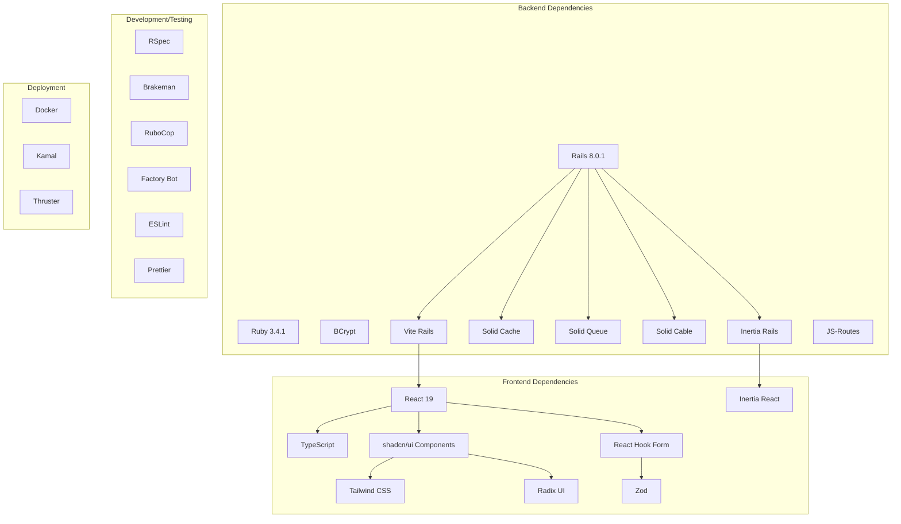

# External Dependencies and Third-Party Services

## TL;DR

The application relies on various external dependencies and third-party libraries including Rails 8.0.1, React 19, Inertia.js, shadcn/ui components, Tailwind CSS, Vite, Solid Queue, Solid Cache, and Docker/Kamal for deployment. Each serves a specific purpose in the application architecture and is configured to work seamlessly together.

## Dependency Overview



## Backend Dependencies

### Core Framework

| Dependency | Version | Purpose | Configuration |
|------------|---------|---------|---------------|
| Rails | 8.0.1 | Web application framework | `config/application.rb` |
| Ruby | 3.4.1 | Programming language | `.ruby-version` |
| Propshaft | Latest | Modern asset pipeline | Default configuration |
| SQLite/PostgreSQL | Latest | Database | `config/database.yml` |
| Puma | ≥5.0 | Web server | `config/puma.rb` |
| BCrypt | ~>3.1.7 | Password hashing | Used by `has_secure_password` |

### Background Processing and Caching

| Dependency | Version | Purpose | Configuration |
|------------|---------|---------|---------------|
| Solid Queue | Latest | Background job processing | `config/queue.yml` |
| Solid Cache | Latest | Caching layer | `config/cache.yml` |
| Solid Cable | Latest | WebSocket support | `config/cable.yml` |

```ruby
# Gemfile
gem "solid_cache"
gem "solid_queue"
gem "solid_cable"
```

### Inertia.js Integration

| Dependency | Version | Purpose | Configuration |
|------------|---------|---------|---------------|
| inertia_rails | ~>3.6 | Connects Rails with React | `config/initializers/inertia_rails.rb` |
| js-routes | Latest | Exposes Rails routes to JavaScript | `config/initializers/js_routes.rb` |

```ruby
# Gemfile
gem "inertia_rails", "~> 3.6"
gem "js-routes"
```

### Frontend Integration

| Dependency | Version | Purpose | Configuration |
|------------|---------|---------|---------------|
| vite_rails | ~>3.0 | Frontend build tool integration | `vite.config.ts`, `config/vite.json` |

```ruby
# Gemfile
gem "vite_rails", "~> 3.0"
```

### Deployment Tools

| Dependency | Version | Purpose | Configuration |
|------------|---------|---------|---------------|
| Kamal | Latest | Deployment orchestration | `config/deploy.yml` |
| Thruster | Latest | HTTP acceleration for Puma | Used in Docker entrypoint |

```ruby
# Gemfile
gem "kamal", require: false, group: [:development, :deploy]
gem "thruster", require: false
```

## Frontend Dependencies

### Core Libraries

| Dependency | Version | Purpose | Configuration |
|------------|---------|---------|---------------|
| React | 19.0.0 | UI library | Vite configuration |
| React DOM | 19.0.3 | DOM renderer for React | Imported in components |
| TypeScript | 5.7.3 | Type-safe JavaScript | `tsconfig.json` |
| @inertiajs/react | 2.0.3 | Inertia.js client for React | Entry point configuration |

### UI Components

| Dependency | Version | Purpose | Configuration |
|------------|---------|---------|---------------|
| shadcn/ui | N/A | Component collection | Used throughout components |
| Radix UI | Various | Primitive UI components | Used by shadcn/ui |
| Tailwind CSS | 4.0.6 | Utility-first CSS | `tailwind.config.js` |
| tailwindcss-animate | 1.0.7 | Animation utilities | Tailwind plugin |
| Sonner | 2.0.1 | Toast notifications | Flash messages |
| Lucide React | 0.477.0 | Icon library | Used in components |

Notable Radix UI components:
- @radix-ui/react-avatar
- @radix-ui/react-checkbox
- @radix-ui/react-dialog
- @radix-ui/react-dropdown-menu
- @radix-ui/react-navigation-menu
- @radix-ui/react-toast

### Form Handling

| Dependency | Version | Purpose | Configuration |
|------------|---------|---------|---------------|
| React Hook Form | 7.54.2 | Form state management | Used in form components |
| Zod | 3.24.2 | Schema validation | Used with React Hook Form |
| @hookform/resolvers | 4.1.2 | Connects Zod with React Hook Form | Import in form files |

### Styling Utilities

| Dependency | Version | Purpose | Configuration |
|------------|---------|---------|---------------|
| class-variance-authority | 0.7.1 | Conditional class utilities | Used in UI components |
| clsx | 2.1.1 | Class name utilities | Used in UI components |
| tailwind-merge | 3.0.1 | Tailwind class merging | Used in UI components |
| next-themes | 0.4.4 | Theme management | Used for dark/light mode |

## Development and Testing Dependencies

### Ruby Testing

| Dependency | Version | Purpose | Configuration |
|------------|---------|---------|---------------|
| rspec-rails | ~>7.1 | Testing framework | `spec/rails_helper.rb` |
| factory_bot_rails | Latest | Test data generation | `spec/factories/` |
| capybara | Latest | Integration testing | Not actively used |
| selenium-webdriver | Latest | Browser automation | Not actively used |

### Code Quality

| Dependency | Version | Purpose | Configuration |
|------------|---------|---------|---------------|
| rubocop-rails-omakase | Latest | Ruby linting | `.rubocop.yml` |
| brakeman | Latest | Security scanning | Run via `bin/brakeman` |
| eslint | 9.19.0 | JavaScript/TypeScript linting | `eslint.config.js` |
| prettier | 3.4.2 | Code formatting | `.prettierrc` |
| typescript-eslint | 8.22.0 | TypeScript-specific linting | ESLint configuration |

## Configuration and Integration

### Package.json Scripts

```json
"scripts": {
  "check": "tsc -p tsconfig.app.json && tsc -p tsconfig.node.json",
  "lint": "eslint app/frontend --report-unused-disable-directives --max-warnings 0",
  "lint:fix": "npm run lint -- --fix",
  "format": "prettier --check 'app/frontend/**/*.{ts,tsx,js}'",
  "format:fix": "npm run format -- --write"
}
```

### Vite Configuration

```typescript
// vite.config.ts
import react from '@vitejs/plugin-react'
import tailwindcss from '@tailwindcss/vite'
import { defineConfig } from 'vite'
import RubyPlugin from 'vite-plugin-ruby'

export default defineConfig({
  ssr: {
    noExternal: true,
  },
  plugins: [
    react(),
    tailwindcss(),
    RubyPlugin(),
  ],
})
```

### Tailwind Configuration

```javascript
// tailwind.config.js (simplified)
module.exports = {
  darkMode: ["class"],
  content: [
    "./app/views/**/*.{html,html.erb,erb}",
    "./app/frontend/**/*.{js,ts,jsx,tsx}",
  ],
  theme: {
    extend: {
      colors: {
        // Theme colors
      }
    },
  },
  plugins: [
    require("tailwindcss-animate"),
    require("@tailwindcss/typography"),
    require("@tailwindcss/forms"),
  ],
}
```

## Third-Party Services Integration

While the application does not directly integrate with third-party services out of the box, it's designed to easily connect with:

### Email Services

The application is configured to work with SMTP email providers:

```ruby
# config/environments/production.rb
config.action_mailer.smtp_settings = {
  address: ENV.fetch("SMTP_ADDRESS", "smtp.mailgun.org"),
  port: ENV.fetch("SMTP_PORT", 587),
  domain: ENV.fetch("SMTP_DOMAIN", "example.com"),
  authentication: ENV.fetch("SMTP_AUTHENTICATION", "plain"),
  user_name: ENV.fetch("SMTP_USERNAME", nil),
  password: ENV.fetch("SMTP_PASSWORD", nil),
  enable_starttls_auto: true
}
```

Common providers that can be used:
- SendGrid
- Mailgun
- Postmark
- AWS SES

### Storage Services

While not configured by default, the application can easily integrate with:
- AWS S3
- Google Cloud Storage
- Azure Blob Storage

For file uploads using Active Storage.

### Monitoring and Logging

The application is designed to work with:
- Datadog
- New Relic
- Sentry
- Honeybadger

By adding the appropriate gems and configuration.

## Dependency Management

### Ruby Dependency Management

Dependencies are managed through Bundler:

```ruby
# Gemfile
source "https://rubygems.org"

gem "rails", "~> 8.0.1"
# Other gems...

group :development, :test do
  # Development/test gems...
end
```

Commands for managing dependencies:
- `bundle install` - Install dependencies
- `bundle update` - Update dependencies
- `bundle outdated` - Check for outdated gems

### JavaScript Dependency Management

Dependencies are managed through npm:

```json
// package.json
{
  "dependencies": {
    "react": "^19.0.0",
    // Other dependencies...
  },
  "devDependencies": {
    "eslint": "^9.19.0",
    // Other dev dependencies...
  }
}
```

Commands for managing dependencies:
- `npm install` - Install dependencies
- `npm update` - Update dependencies
- `npm outdated` - Check for outdated packages

## Deployment Dependencies

### Docker

The application is containerized using Docker:

```dockerfile
# Dockerfile
ARG RUBY_VERSION=3.4.1
FROM docker.io/library/ruby:$RUBY_VERSION-slim AS base

# Configuration...

# Set production environment
ENV RAILS_ENV="production" \
    BUNDLE_DEPLOYMENT="1" \
    BUNDLE_PATH="/usr/local/bundle" \
    BUNDLE_WITHOUT="development"

# Multi-stage build configuration...
```

### Kamal Deployment

Deployment is handled through Kamal:

```yaml
# config/deploy.yml
service: inertia_rails_shadcn_starter
image: your-user/inertia_rails_shadcn_starter

servers:
  web:
    - 192.168.0.1

# Other deployment configuration...
```

## Dependency Update Strategy

### Keeping Ruby Dependencies Updated

- Use `bundle outdated` to identify outdated gems
- Update gems one at a time with `bundle update [gem name]`
- Run tests after each update
- Use `bundle audit` to check for security vulnerabilities

### Keeping JavaScript Dependencies Updated

- Use `npm outdated` to identify outdated packages
- Update packages with `npm update` or manually update in `package.json`
- Run linting and type checking after updates
- Consider tools like Dependabot for automated updates

## Limitations and Considerations

1. **Version Compatibility**: Always ensure Rails, React, and Inertia versions remain compatible
2. **Node.js Version**: The application requires Node.js 22.13.1 for building (specified in Dockerfile)
3. **Ruby Version**: Ruby 3.4.1 is required (specified in `.ruby-version` and Dockerfile)
4. **Database Flexibility**: The application uses SQLite by default but is designed to work with PostgreSQL
5. **shadcn/ui Updates**: shadcn/ui components are copied into the project, not imported as a package, requiring manual updates
