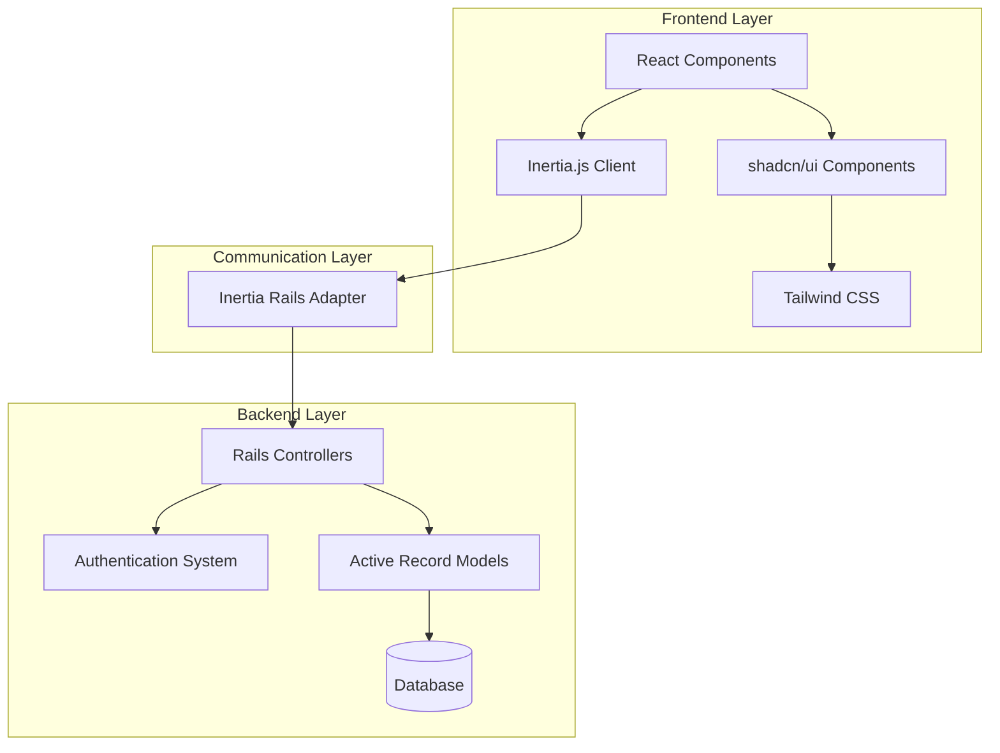

# Inertia Rails ShadCN Starter Documentation

## Executive Summary

This application is a modern full-stack starter template that combines Ruby on Rails 8 with React 19, connected via Inertia.js. It features a complete authentication system, UI components from shadcn/ui styled with Tailwind CSS, and a Docker-based deployment pipeline using Kamal.

The architecture follows a hybrid approach where Rails handles routing, authentication, and data persistence, while React provides a rich, interactive frontend experience without the complexity of a separate API. This creates a developer-friendly experience with the best of both worlds: Rails' convention-over-configuration and React's component-based UI.



## Key Architectural Patterns

1. **Inertia.js Pattern**: Uses server-side routing with client-side rendering for a SPA-like experience without API complexity.
2. **Component-Based UI**: Leverages shadcn/ui components backed by Radix UI primitives for accessible, customizable interfaces.
3. **Monolithic Repository**: All code (frontend and backend) lives in a single repository, simplifying development workflow.
4. **Authentication Zero**: Provides a complete authentication system with session management and email verification.
5. **Docker-Based Deployment**: Containerized deployment with Kamal for consistent environments.
6. **TypeScript Integration**: Complete TypeScript support for better type safety in the frontend.

## Context Files Overview

This documentation is organized into context files, each covering a specific aspect of the application:

### Core Contexts

- **01_application_overview.md**: High-level overview of the application architecture and technologies
- **02_frontend_architecture.md**: Detailed frontend architecture using React, TypeScript, and Inertia.js
- **03_ui_components.md**: UI component system with shadcn/ui and Tailwind CSS styling
- **04_backend_architecture.md**: Rails backend architecture, controllers, and routing
- **05_authentication_system.md**: Custom authentication system with multi-device session support

### Additional Contexts

- **06_testing_and_quality_assurance.md**: Testing approach, tools, and quality assurance processes
- **07_database_schema_and_models.md**: Database models, schema, and data access patterns
- **08_deployment_and_ci_cd.md**: Deployment pipeline, Docker configuration, and CI/CD process
- **09_configuration_management.md**: Application configuration, environment variables, and settings
- **10_security_and_error_handling.md**: Security measures and error handling strategies
- **11_api_design.md**: API architecture, endpoints, and data flow between frontend and backend
- **12_external_dependencies.md**: External dependencies, third-party services, and integrations

## Getting Started for Developers

### Prerequisites

- Ruby 3.4.1
- Node.js 20+
- PostgreSQL (optional, default is SQLite)
- Docker (for production deployment)

### Setup

1. Clone the repository
   ```bash
   git clone https://github.com/yourusername/inertia-rails-shadcn-starter.git
   cd inertia-rails-shadcn-starter
   ```

2. Run the setup script
   ```bash
   bin/setup
   ```

3. Start the development server
   ```bash
   bin/dev
   ```

4. Visit http://localhost:3000 in your browser

### Development Workflow

- Backend code lives in standard Rails locations (`app/controllers`, `app/models`, etc.)
- Frontend code lives in `app/frontend`
- New pages should be added to `app/frontend/pages` with corresponding routes in `config/routes.rb`
- UI components are in `app/frontend/components`

## Using This Documentation

These context files are designed to help developers and LLMs understand the application structure and implementation details. Here's how to make the most of them:

1. **For New Developers**:
   - Start with this README for a high-level overview
   - Read 01_application_overview.md for more details on the application structure
   - Explore context files relevant to your immediate task

2. **For Experienced Developers**:
   - Use the context files as reference when working on specific parts of the application
   - Refer to 00_context_directory.md to quickly find relevant documentation

3. **For LLM Interactions**:
   - Reference these documents to provide context for code generation or troubleshooting
   - Use the detailed code examples to understand implementation patterns

4. **Contributing to Documentation**:
   - Keep context files updated when making significant changes to the application
   - Follow the established format for consistency
   - Use code examples from the actual codebase whenever possible

## Domain-Specific Terminology

| Term | Definition |
|------|------------|
| Inertia.js | A frontend framework that allows you to create SPA-like applications without building an API |
| shadcn/ui | A collection of reusable UI components built with Radix UI and Tailwind CSS |
| Kamal | A deployment tool that deploys Rails applications to servers using Docker |
| SSR | Server-Side Rendering, an optional feature for improved initial page loads and SEO |
